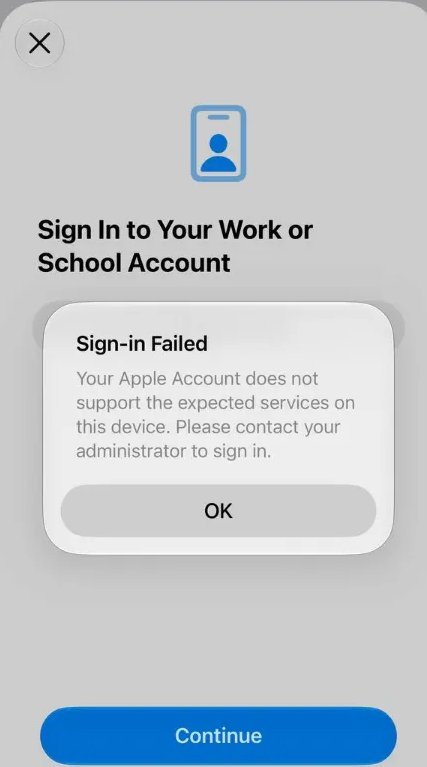
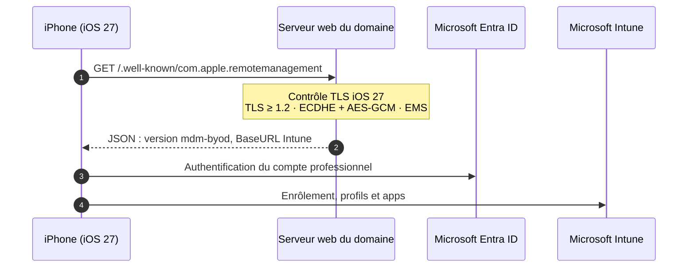
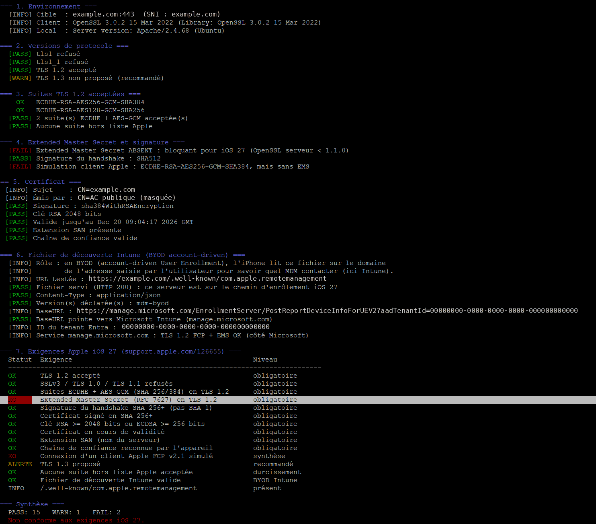
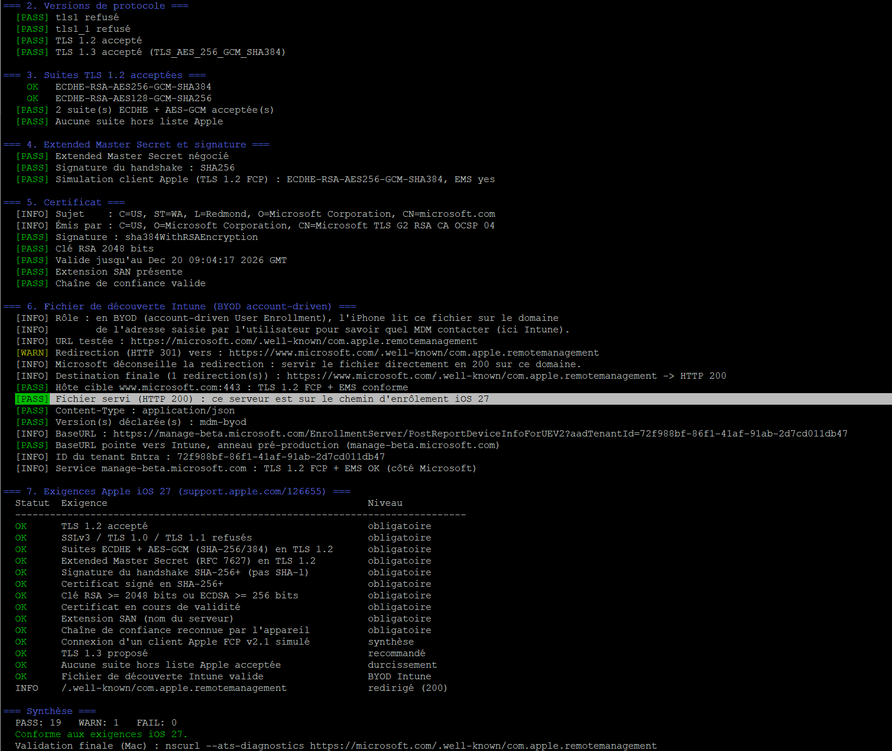
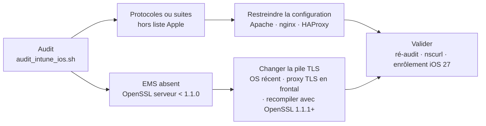

# audit-intune-ios

Audit TLS du serveur qui publie le fichier de découverte de l'enrôlement BYOD Intune, face aux nouvelles exigences d'Apple depuis iOS 27.

Depuis iOS, iPadOS et macOS 27, Apple refuse les connexions d'enrôlement vers un serveur dont la configuration TLS n'est pas conforme (ATS / FCP v2.1). En BYOD Intune « account-driven », l'iPhone affiche alors :

> Your Apple Account does not support the expected services

<p align="center"></p>

Le message évoque le compte Apple, mais la cause est côté serveur. Les appareils déjà enrôlés avant iOS 27 ne sont pas touchés : seuls les nouveaux enrôlements, ou ceux refaits sous iOS 27, sont bloqués.

## Préambule : les types d'enrôlement iOS dans Intune

Intune propose huit façons de prendre en charge un iPhone ou un iPad. **Une seule passe par le site web de votre organisation** : l'enrôlement utilisateur account-driven, qui lit le fichier de découverte `/.well-known/com.apple.remotemanagement`.


| Type | Appareil | Lancé depuis | Séparation des données | Lit `/.well-known` |
| --- | --- | --- | --- | --- |
| Protection d'applications (MAM, sans enrôlement) | personnel | app Outlook, Teams… | au niveau des apps | non |
| Enrôlement web (JIT, Authenticator) | personnel | Safari | non | non |
| **Enrôlement utilisateur account-driven** | personnel | Réglages > VPN et gestion | oui | **oui** |
| Enrôlement de l'appareil (Portail d'entreprise) | personnel | Portail d'entreprise | non | non |
| Enrôlement au choix de l'utilisateur | personnel | Portail d'entreprise | selon le choix | non |
| Automated Device Enrollment (Apple Business Manager) | entreprise | assistant de configuration | non, supervisé | non |
| Apple Configurator, assistant | entreprise | Mac + câble (réinitialise) | non, supervisé | non |
| Apple Configurator, direct | entreprise | Mac + câble (sans réinitialisation) | non | non |

Sources : [CloudTek Space](https://www.cloudtekspace.com/post/different-types-of-ios-ipados-enrollment-in-intune), [Microsoft Learn](https://learn.microsoft.com/mem/intune/enrollment/apple-account-driven-user-enrollment).


## Périmètre : le BYOD Intune

Ce dépôt concerne l'**enrôlement BYOD** des appareils personnels, en mode **« account-driven User Enrollment »** (iOS / iPadOS 15 et plus). L'utilisateur lance l'enrôlement lui-même depuis Réglages > Général > VPN et gestion de l'appareil, en saisissant son adresse professionnelle. C'est le seul mode qui passe par **votre** serveur web.

| Mode d'enrôlement | Appareils | Passe par votre serveur web ? | Concerné par ce dépôt |
| --- | --- | --- | --- |
| Account-driven User Enrollment | personnels (BYOD) | oui, fichier de découverte | **oui** |
| Automated Device Enrollment (Apple Business Manager) | professionnels | non, directement vers Intune | non |
| Enrôlement via Portail d'entreprise (ancien mode) | personnels | non | non |

Les connexions vers les services Microsoft (Entra ID, Intune) sont conformes et gérées par Microsoft. Si votre organisation héberge d'autres serveurs utilisés par les appareils Apple gérés (distribution d'apps internes, profils), ils sont soumis aux mêmes exigences et peuvent être audités avec le même script.

## Le fichier de découverte (section 6 du script)

En BYOD account-driven, l'iPhone ne connaît pas encore votre MDM. Il le découvre à partir du **domaine de l'adresse saisie** par l'utilisateur : pour `prenom.nom@example.com`, il lit `https://example.com/.well-known/com.apple.remotemanagement`. Ce fichier lui indique quel MDM contacter et à quelle adresse.

Format attendu pour Intune ([documentation Microsoft](https://learn.microsoft.com/mem/intune/enrollment/apple-account-driven-user-enrollment)) :

```json
{"Servers":[{"Version":"mdm-byod","BaseURL":"https://manage.microsoft.com/EnrollmentServer/PostReportDeviceInfoForUEV2?aadTenantId=<ID-du-tenant-Entra>"}]}
```

| Exigence de publication | Valeur |
| --- | --- |
| Emplacement | racine du domaine de connexion des utilisateurs |
| Nom | `com.apple.remotemanagement`, **sans extension** |
| Protocole | HTTPS, conforme aux exigences TLS d'iOS 27 |
| Content-Type | `application/json` |
| Redirection | déconseillée : répondre directement en 200 |
| Champ `Version` | `mdm-byod` |
| Champ `BaseURL` | point d'enrôlement Intune avec l'ID du tenant Entra |

La section 6 de `audit_intune_ios.sh` contrôle chacun de ces points :

| Contrôle | Résultat attendu |
| --- | --- |
| Présence du fichier | HTTP 200 direct. Une redirection est signalée en alerte, puis suivie (5 sauts max) : destination finale, passage en HTTP non chiffré, conformité TLS de l'hôte cible |
| Content-Type | `application/json` |
| Champ `Version` | contient `mdm-byod`, sinon l'enrôlement BYOD n'est pas proposé |
| Champ `BaseURL` | HTTPS, pointe vers `manage.microsoft.com` |
| Service Microsoft (informatif) | TLS 1.2 FCP et EMS sur l'hôte de la BaseURL |

Le serveur qui publie ce fichier est souvent le site vitrine ou un reverse proxy, géré par une autre équipe ou un prestataire. C'est lui qu'il faut auditer en premier : s'il échoue au contrôle TLS, l'iPhone s'arrête avant même d'atteindre Intune.

Pour vérifier rapidement à la main :

```bash
curl -i https://example.com/.well-known/com.apple.remotemanagement
```

## Ce que montrent les logs du serveur web

**Avant la correction**, le journal d'accès ne contient **aucune ligne** pour les iPhone en iOS 27 : la négociation TLS échoue avant toute requête HTTP. Pour voir ces échecs, passer temporairement le journal d'erreurs Apache en `LogLevel ssl:info`.

**Après la correction**, chaque tentative laisse une trace (adresse et identifiant anonymisés) :

```text
203.0.113.24 - - [04/Oct/2026:17:36:12 +0200] "GET /.well-known/com.apple.remotemanagement?user-identifier=prenom.nom@example.com&model-family=iPhone HTTP/1.1" 200 360
```

| Élément | Signification |
| --- | --- |
| `user-identifier` | l'adresse saisie par l'utilisateur dans Réglages |
| `model-family` | le type d'appareil : `iPhone`, `iPad`… |
| `200` | fichier servi : la découverte a réussi |
| `360` | taille de la réponse en octets (le JSON Intune) |

| Pour un utilisateur bloqué, le journal montre… | Où chercher |
| --- | --- |
| aucune ligne | TLS non conforme, ou réseau |
| un code 404 ou 30x | fichier absent ou redirigé sur ce vhost |
| un code 200, puis l'enrôlement échoue | après la découverte : Entra ID ou configuration Intune |

```bash
grep -h "com.apple.remotemanagement" /var/log/httpd/*access_log* | tail -20                      # dernières tentatives
tail -f /var/log/httpd/ssl_access_log | grep --line-buffered "remotemanagement"                   # suivi en direct
grep -h "com.apple.remotemanagement" /var/log/httpd/*access_log* | awk '{print substr($4,2,11)}' | sort | uniq -c   # par jour
grep -ho "user-identifier=[^& ]*" /var/log/httpd/*access_log* | sort -u                          # utilisateurs distincts
```

Ces journaux contiennent des adresses professionnelles nominatives : appliquez-leur votre durée de conservation (RGPD).

## Le parcours d'enrôlement BYOD

Seule l'étape 1 dépend de votre infrastructure : c'est elle qu'audite le script.



## Exigences Apple

| Exigence | Niveau |
| --- | --- |
| TLS 1.2 minimum (SSLv3, TLS 1.0, TLS 1.1 refusés) | obligatoire |
| Suites TLS 1.2 ECDHE + AES-GCM (SHA-256/384) | obligatoire |
| Extended Master Secret (RFC 7627) en TLS 1.2 | obligatoire |
| Signature du handshake SHA-256 ou plus | obligatoire |
| Certificat : RSA ≥ 2048 ou ECDSA ≥ 256, signé SHA-256+, SAN, chaîne valide | obligatoire |
| TLS 1.3 | recommandé |

Référence : [Apple Support, Prepare your network environment for stricter security requirements](https://support.apple.com/en-qa/126655).

### D'où viennent ces exigences

Apple applique aux connexions de gestion des appareils deux référentiels existants :

- **App Transport Security (ATS)** : la politique TLS imposée depuis des années aux applications iOS (TLS 1.2 minimum, confidentialité persistante, certificats solides).
- **Functional Package for TLS 2.1 (FCP v2.1)** : un référentiel du NIAP, l'organisme américain de certification des produits de sécurité. Il ajoute notamment les suites AES-GCM uniquement et l'Extended Master Secret.

Depuis iOS 27, les deux s'appliquent au MDM, à l'enrôlement, aux profils, aux apps et aux mises à jour.

### L'Extended Master Secret, c'est quoi ?

En TLS 1.2, le client et le serveur calculent un secret commun, le *master secret*, d'où sont tirées toutes les clés de la session. Dans la version d'origine du protocole, il dépend seulement du secret échangé pendant la négociation et de deux nombres aléatoires (un du client, un du serveur).

En 2014, l'attaque **« Triple Handshake »** a montré qu'un serveur malveillant pouvait s'interposer et faire partager le même master secret à deux connexions distinctes : la sienne avec le client, et celle avec le vrai serveur. Combinée à la reprise de session et à la renégociation, elle permettait d'usurper l'identité d'un client, même authentifié par certificat.

L'**Extended Master Secret** ([RFC 7627](https://www.rfc-editor.org/rfc/rfc7627), 2015) corrige ce défaut : le master secret est calculé à partir d'une empreinte de **tous les messages de la négociation**. Deux connexions différentes ne peuvent plus aboutir au même secret. Le client annonce l'extension `extended_master_secret` dans son premier message, et le serveur l'accepte en la renvoyant.

| Version | Calcul du master secret | Accepté par iOS 27 |
| --- | --- | --- |
| TLS 1.2 sans EMS | secret négocié + aléas client et serveur | non |
| TLS 1.2 avec EMS | secret négocié + empreinte de toute la négociation | oui |
| TLS 1.3 | protection intégrée au protocole, l'extension n'existe plus | oui |

L'EMS ne concerne donc que TLS 1.2, mais un iPhone peut s'y replier : le serveur doit alors l'accepter.

**Le piège :** l'EMS ne se configure pas. Il est implémenté dans la bibliothèque TLS et activé automatiquement à partir d'**OpenSSL 1.1.0**. Un serveur lié à OpenSSL 1.0.2 (RHEL / CentOS 7 notamment) reste non conforme quelle que soit sa configuration : il faut changer de bibliothèque, donc de version du serveur ou de l'OS.

```bash
openssl s_client -connect example.com:443 -servername example.com -tls1_2 </dev/null 2>/dev/null | grep "Extended master secret"
# Extended master secret: yes   -> conforme
# Extended master secret: no    -> bloquant pour iOS 27
```

## Utilisation

```bash
git clone https://github.com/BouCloud/audit-intune-ios.git
cd audit-intune-ios
chmod +x audit_intune_ios.sh

./audit_intune_ios.sh example.com                       # domaine de connexion des utilisateurs (après le @)
./audit_intune_ios.sh 10.0.0.12 443 example.com         # IP interne du serveur, nom public en SNI
OPENSSL=/usr/bin/openssl11 ./audit_intune_ios.sh example.com   # client OpenSSL spécifique
```

| Point | Détail |
| --- | --- |
| Systèmes | Tout Linux (RHEL, Rocky, Alma, Debian, Ubuntu, SUSE, Alpine), macOS avec OpenSSL Homebrew |
| Dépendances | `bash`, `openssl` 1.1.1+ côté client (TLS 1.3 et EMS), `curl` en option |
| Impact | Lecture seule, peut viser un serveur distant |
| Code retour | `0` conforme, `1` non conforme, `2` erreur (utilisable en supervision) |

**Sous Windows**, le script s'exécute dans **Git Bash** (installé avec Git pour Windows : clic droit dans le dossier > *Open Git Bash here*) ou dans **WSL** (`wsl --install -d Ubuntu`). Il ne fonctionne pas directement dans PowerShell. Si l'erreur `$'\r': command not found` apparaît, les fins de ligne ont été converties : `sed -i 's/\r$//' audit_intune_ios.sh`.

## Ce que contrôle le script

| Section | Contrôles |
| --- | --- |
| 2. Versions de protocole | TLS 1.0 / 1.1 refusés, TLS 1.2 accepté, TLS 1.3 proposé |
| 3. Suites TLS 1.2 | Énumération des suites acceptées, conformes ou hors liste Apple |
| 4. EMS et signature | Extended Master Secret, signature du handshake, simulation d'un iPhone en mode FCP v2.1 |
| 5. Certificat | Signature, taille de clé, validité, SAN, chaîne de confiance |
| 6. Fichier de découverte Intune | Présence, Content-Type, version `mdm-byod`, BaseURL Intune, TLS du service Microsoft (informatif) |
| 7. Exigences Apple | Récapitulatif exigence par exigence |

Extrait du récapitulatif :

```text
=== 7. Exigences Apple iOS 27 (support.apple.com/126655) ===
  Statut  Exigence                                             Niveau
  ------------------------------------------------------------------------------
  OK      TLS 1.2 accepté                                      obligatoire
  OK      SSLv3 / TLS 1.0 / TLS 1.1 refusés                    obligatoire
  OK      Suites ECDHE + AES-GCM (SHA-256/384) en TLS 1.2      obligatoire
  OK      Extended Master Secret (RFC 7627) en TLS 1.2         obligatoire
  OK      Signature du handshake SHA-256+ (pas SHA-1)          obligatoire
  OK      Certificat signé en SHA-256+                         obligatoire
  OK      Clé RSA >= 2048 bits ou ECDSA >= 256 bits            obligatoire
  OK      Certificat en cours de validité                      obligatoire
  OK      Extension SAN (nom du serveur)                       obligatoire
  OK      Chaîne de confiance reconnue par l'appareil          obligatoire
  OK      Connexion d'un client Apple FCP v2.1 simulé          synthèse
  OK      TLS 1.3 proposé                                      recommandé
  ALERTE  Aucune suite hors liste Apple acceptée               durcissement
  OK      Fichier de découverte Intune valide                  BYOD Intune
  INFO    /.well-known/com.apple.remotemanagement              présent
```

### Exemple : avant et après

**Avant** : serveur encore lié à un OpenSSL ancien (domaine et certificat masqués). TLS 1.3 absent, **Extended Master Secret absent**, la simulation du client Apple échoue : 2 échecs, non conforme.



**Après** : exemple réel sur microsoft.com (Microsoft utilise lui-même l'enrôlement account-driven) : conforme, avec une seule alerte pour la redirection vers `www.microsoft.com`.



Une suite acceptée hors liste Apple (DHE, CHACHA20, CBC…) est une alerte, pas un échec : l'iPhone ne la propose pas, elle n'est donc jamais négociée avec lui. La retirer reste du bon durcissement.

## Remédiation

### Configuration express

1. **Serveur web à jour** : lié à OpenSSL 1.1.1 ou plus (EMS + TLS 1.3). Apache 2.4.37+, nginx 1.13+, HAProxy 2.x ; d'origine sur RHEL / Rocky / Alma 8+, Debian 10+, Ubuntu 20.04+.
2. **Protocoles et suites forcés** :

```apache
# Apache : ssl.conf, hors <VirtualHost> et dans <VirtualHost _default_:443>
SSLProtocol          -all +TLSv1.2 +TLSv1.3
SSLCipherSuite       ECDHE-ECDSA-AES256-GCM-SHA384:ECDHE-RSA-AES256-GCM-SHA384:ECDHE-ECDSA-AES128-GCM-SHA256:ECDHE-RSA-AES128-GCM-SHA256
SSLHonorCipherOrder  on
```

```nginx
ssl_protocols             TLSv1.2 TLSv1.3;
ssl_ciphers               ECDHE-ECDSA-AES256-GCM-SHA384:ECDHE-RSA-AES256-GCM-SHA384:ECDHE-ECDSA-AES128-GCM-SHA256:ECDHE-RSA-AES128-GCM-SHA256;
ssl_prefer_server_ciphers on;
```

3. **Recharger** le service, puis relancer l'audit.

### Démarche complète



| Fichier | Logiciel | Version minimale (TLS 1.3 + EMS) |
| --- | --- | --- |
| [`configs/apache-ssl.conf`](configs/apache-ssl.conf) | Apache httpd | 2.4.37, lié à OpenSSL 1.1.1 |
| [`configs/nginx-ssl.conf`](configs/nginx-ssl.conf) | nginx | 1.13, lié à OpenSSL 1.1.1 |
| [`configs/haproxy.cfg`](configs/haproxy.cfg) | HAProxy | 2.x, lié à OpenSSL 1.1.1 |

Vérifier la bibliothèque réellement utilisée par le serveur, et non celle de la commande `openssl` :

```bash
nginx -V 2>&1 | grep -i openssl
haproxy -vv | grep -i openssl
ldd "$(find / -name mod_ssl.so 2>/dev/null | head -1)" | grep libssl   # libssl.so.1.1 ou .so.3
```

## Validation finale

1. `audit_intune_ios.sh` : 0 échec.
2. Sur un Mac : `nscurl --ats-diagnostics https://example.com/.well-known/com.apple.remotemanagement`, le test FCP_v2.1 doit afficher `PASS`.
3. Enrôlement réel sur un appareil **en iOS 27**. Un appareil en iOS 26 s'enrôle même face à un serveur non conforme et ne prouve rien.

## Contenu du dépôt

```text
.
├── audit_intune_ios.sh             script d'audit
├── configs/
│   ├── apache-ssl.conf
│   ├── nginx-ssl.conf
│   └── haproxy.cfg
└── docs/
    ├── index.html                  page de documentation (GitHub Pages / blog)
    ├── diagramme-intune-ios27.svg  schéma enrôlement et remédiation
    ├── diagramme-types-enrolement.svg  types d'enrôlement Intune
    ├── erreur-enrolement-ios27.jpg     capture de l'erreur iOS 27
    ├── audit-microsoft-com.png         exemple d'audit conforme (microsoft.com)
    ├── audit-echec-ems.png             exemple d'audit non conforme (EMS absent)
    └── audit_intune_ios.sh         copie du script, téléchargeable depuis la page
```

## Licence

MIT. Voir [LICENSE](LICENSE).

Auteur : Chris Bousquet, [creaskill.mccool.fr](https://creaskill.mccool.fr/)
