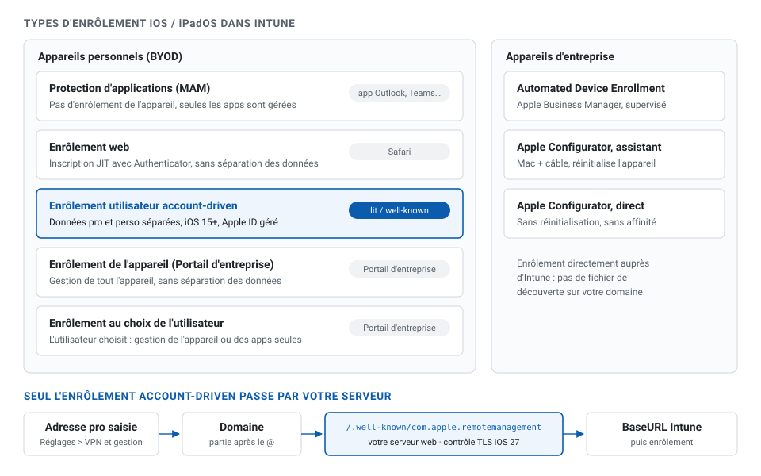
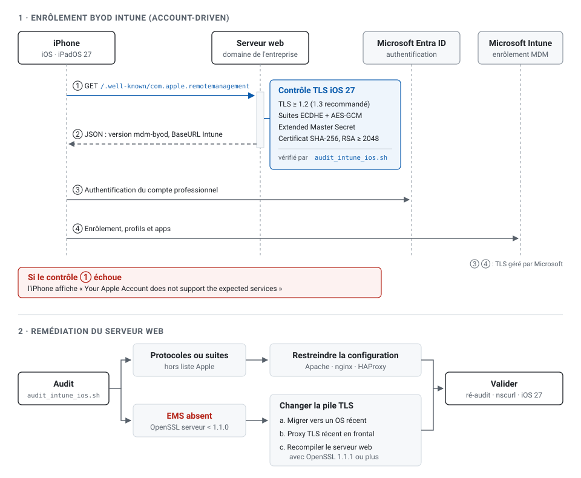
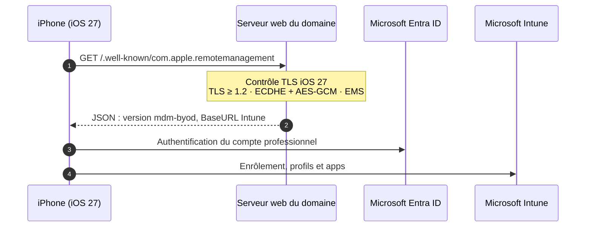
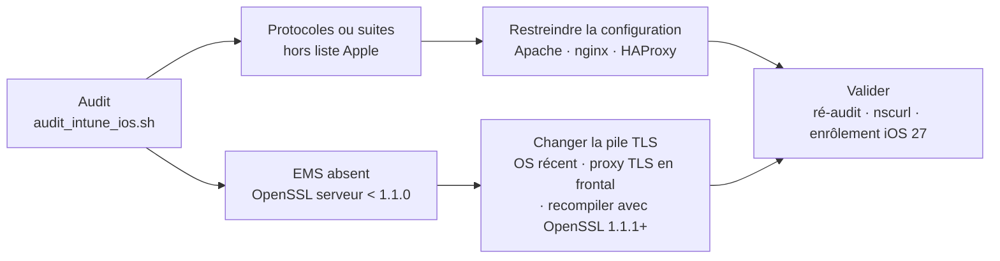

# audit-intune-ios

Audit TLS du serveur qui publie le fichier de découverte de l'enrôlement BYOD Intune, face aux nouvelles exigences d'Apple depuis iOS 27.

Depuis iOS, iPadOS et macOS 27, Apple refuse les connexions d'enrôlement vers un serveur dont la configuration TLS n'est pas conforme (ATS / FCP v2.1). En BYOD Intune « account-driven », l'iPhone affiche alors :

> Your Apple Account does not support the expected services

Le message évoque le compte Apple, mais la cause est côté serveur. Les appareils déjà enrôlés avant iOS 27 ne sont pas touchés : seuls les nouveaux enrôlements, ou ceux refaits sous iOS 27, sont bloqués.

## Préambule : les types d'enrôlement iOS dans Intune

Intune propose huit façons de prendre en charge un iPhone ou un iPad. **Une seule passe par le site web de votre organisation** : l'enrôlement utilisateur account-driven, qui lit le fichier de découverte `/.well-known/com.apple.remotemanagement`.



| Type | Appareil | Lancé depuis | Séparation des données | Lit `/.well-known` |
| --- | --- | --- | --- | --- |
| Protection d'applications (MAM, sans enrôlement) | personnel | app Outlook, Teams… | au niveau des apps | non |
| Enrôlement web (JIT, Authenticator) | personnel | Safari | non | non |
| **Enrôlement utilisateur account-driven** | personnel | Réglages > VPN et gestion | oui | **oui** |
| Enrôlement de l'appareil (Portail d'entreprise) | personnel | Portail d'entreprise | non | non |
| Enrôlement au choix de l'utilisateur | personnel | Portail d'entreprise | selon le choix | non |
| Automated Device Enrollment (Apple Business Manager) | entreprise | assistant de configuration | non, supervisé | non |
| Apple Configurator, assistant | entreprise | Mac + câble (réinitialise) | non, supervisé | non |
| Apple Configurator, direct | entreprise | Mac + câble (sans réinitialisation) | non | non |

Sources : [CloudTek Space](https://www.cloudtekspace.com/post/different-types-of-ios-ipados-enrollment-in-intune), [Microsoft Learn](https://learn.microsoft.com/mem/intune/enrollment/apple-account-driven-user-enrollment).



## Périmètre : le BYOD Intune

Ce dépôt concerne l'**enrôlement BYOD** des appareils personnels, en mode **« account-driven User Enrollment »** (iOS / iPadOS 15 et plus). L'utilisateur lance l'enrôlement lui-même depuis Réglages > Général > VPN et gestion de l'appareil, en saisissant son adresse professionnelle. C'est le seul mode qui passe par **votre** serveur web.

| Mode d'enrôlement | Appareils | Passe par votre serveur web ? | Concerné par ce dépôt |
| --- | --- | --- | --- |
| Account-driven User Enrollment | personnels (BYOD) | oui, fichier de découverte | **oui** |
| Automated Device Enrollment (Apple Business Manager) | professionnels | non, directement vers Intune | non |
| Enrôlement via Portail d'entreprise (ancien mode) | personnels | non | non |

Les connexions vers les services Microsoft (Entra ID, Intune) sont conformes et gérées par Microsoft. Si votre organisation héberge d'autres serveurs utilisés par les appareils Apple gérés (distribution d'apps internes, profils), ils sont soumis aux mêmes exigences et peuvent être audités avec le même script.

## Le fichier de découverte (section 6 du script)

En BYOD account-driven, l'iPhone ne connaît pas encore votre MDM. Il le découvre à partir du **domaine de l'adresse saisie** par l'utilisateur : pour `prenom.nom@example.com`, il lit `https://example.com/.well-known/com.apple.remotemanagement`. Ce fichier lui indique quel MDM contacter et à quelle adresse.

Format attendu pour Intune ([documentation Microsoft](https://learn.microsoft.com/mem/intune/enrollment/apple-account-driven-user-enrollment)) :

```json
{"Servers":[{"Version":"mdm-byod","BaseURL":"https://manage.microsoft.com/EnrollmentServer/PostReportDeviceInfoForUEV2?aadTenantId=<ID-du-tenant-Entra>"}]}
```

| Exigence de publication | Valeur |
| --- | --- |
| Emplacement | racine du domaine de connexion des utilisateurs |
| Nom | `com.apple.remotemanagement`, **sans extension** |
| Protocole | HTTPS, conforme aux exigences TLS d'iOS 27 |
| Content-Type | `application/json` |
| Redirection | déconseillée : répondre directement en 200 |
| Champ `Version` | `mdm-byod` |
| Champ `BaseURL` | point d'enrôlement Intune avec l'ID du tenant Entra |

La section 6 de `audit_intune_ios.sh` contrôle chacun de ces points :

| Contrôle | Résultat attendu |
| --- | --- |
| Présence du fichier | HTTP 200 (une redirection est signalée en alerte) |
| Content-Type | `application/json` |
| Champ `Version` | contient `mdm-byod`, sinon l'enrôlement BYOD n'est pas proposé |
| Champ `BaseURL` | HTTPS, pointe vers `manage.microsoft.com` |
| Service Microsoft (informatif) | TLS 1.2 FCP et EMS sur l'hôte de la BaseURL |

Le serveur qui publie ce fichier est souvent le site vitrine ou un reverse proxy, géré par une autre équipe ou un prestataire. C'est lui qu'il faut auditer en premier : s'il échoue au contrôle TLS, l'iPhone s'arrête avant même d'atteindre Intune.

Pour vérifier rapidement à la main :

```bash
curl -i https://example.com/.well-known/com.apple.remotemanagement
```

## Le parcours d'enrôlement BYOD

Seule l'étape 1 dépend de votre infrastructure : c'est elle qu'audite le script.



## Exigences Apple

| Exigence | Niveau |
| --- | --- |
| TLS 1.2 minimum (SSLv3, TLS 1.0, TLS 1.1 refusés) | obligatoire |
| Suites TLS 1.2 ECDHE + AES-GCM (SHA-256/384) | obligatoire |
| Extended Master Secret (RFC 7627) en TLS 1.2 | obligatoire |
| Signature du handshake SHA-256 ou plus | obligatoire |
| Certificat : RSA ≥ 2048 ou ECDSA ≥ 256, signé SHA-256+, SAN, chaîne valide | obligatoire |
| TLS 1.3 | recommandé |

Référence : [Apple Support, Prepare your network environment for stricter security requirements](https://support.apple.com/en-qa/126655).

**Le piège :** l'Extended Master Secret ne se configure pas. Il est activé automatiquement à partir d'**OpenSSL 1.1.0**. Un serveur lié à OpenSSL 1.0.2 (RHEL / CentOS 7 notamment) reste non conforme quelle que soit sa configuration.

## Utilisation

```bash
git clone https://github.com/BouCloud/audit-intune-ios.git
cd audit-intune-ios
chmod +x audit_intune_ios.sh

./audit_intune_ios.sh example.com                       # domaine de connexion des utilisateurs (après le @)
./audit_intune_ios.sh 10.0.0.12 443 example.com         # IP interne du serveur, nom public en SNI
OPENSSL=/usr/bin/openssl11 ./audit_intune_ios.sh example.com   # client OpenSSL spécifique
```

| Point | Détail |
| --- | --- |
| Systèmes | Tout Linux (RHEL, Rocky, Alma, Debian, Ubuntu, SUSE, Alpine), macOS avec OpenSSL Homebrew |
| Dépendances | `bash`, `openssl` 1.1.1+ côté client (TLS 1.3 et EMS), `curl` en option |
| Impact | Lecture seule, peut viser un serveur distant |
| Code retour | `0` conforme, `1` non conforme, `2` erreur (utilisable en supervision) |

## Ce que contrôle le script

| Section | Contrôles |
| --- | --- |
| 2. Versions de protocole | TLS 1.0 / 1.1 refusés, TLS 1.2 accepté, TLS 1.3 proposé |
| 3. Suites TLS 1.2 | Énumération des suites acceptées, conformes ou hors liste Apple |
| 4. EMS et signature | Extended Master Secret, signature du handshake, simulation d'un iPhone en mode FCP v2.1 |
| 5. Certificat | Signature, taille de clé, validité, SAN, chaîne de confiance |
| 6. Fichier de découverte Intune | Présence, Content-Type, version `mdm-byod`, BaseURL Intune, TLS du service Microsoft (informatif) |
| 7. Exigences Apple | Récapitulatif exigence par exigence |

Extrait du récapitulatif :

```text
=== 7. Exigences Apple iOS 27 (support.apple.com/126655) ===
  Statut  Exigence                                             Niveau
  ------------------------------------------------------------------------------
  OK      TLS 1.2 accepté                                      obligatoire
  OK      SSLv3 / TLS 1.0 / TLS 1.1 refusés                    obligatoire
  OK      Suites ECDHE + AES-GCM (SHA-256/384) en TLS 1.2      obligatoire
  OK      Extended Master Secret (RFC 7627) en TLS 1.2         obligatoire
  OK      Signature du handshake SHA-256+ (pas SHA-1)          obligatoire
  OK      Certificat signé en SHA-256+                         obligatoire
  OK      Clé RSA >= 2048 bits ou ECDSA >= 256 bits            obligatoire
  OK      Certificat en cours de validité                      obligatoire
  OK      Extension SAN (nom du serveur)                       obligatoire
  OK      Chaîne de confiance reconnue par l'appareil          obligatoire
  OK      Connexion d'un client Apple FCP v2.1 simulé          synthèse
  OK      TLS 1.3 proposé                                      recommandé
  ALERTE  Aucune suite hors liste Apple acceptée               durcissement
  OK      Fichier de découverte Intune valide                  BYOD Intune
  INFO    /.well-known/com.apple.remotemanagement              présent
```

Une suite acceptée hors liste Apple (DHE, CHACHA20, CBC…) est une alerte, pas un échec : l'iPhone ne la propose pas, elle n'est donc jamais négociée avec lui. La retirer reste du bon durcissement.

## Remédiation



| Fichier | Logiciel | Version minimale (TLS 1.3 + EMS) |
| --- | --- | --- |
| [`configs/apache-ssl.conf`](configs/apache-ssl.conf) | Apache httpd | 2.4.37, lié à OpenSSL 1.1.1 |
| [`configs/nginx-ssl.conf`](configs/nginx-ssl.conf) | nginx | 1.13, lié à OpenSSL 1.1.1 |
| [`configs/haproxy.cfg`](configs/haproxy.cfg) | HAProxy | 2.x, lié à OpenSSL 1.1.1 |

Vérifier la bibliothèque réellement utilisée par le serveur, et non celle de la commande `openssl` :

```bash
nginx -V 2>&1 | grep -i openssl
haproxy -vv | grep -i openssl
ldd "$(find / -name mod_ssl.so 2>/dev/null | head -1)" | grep libssl   # libssl.so.1.1 ou .so.3
```

## Validation finale

1. `audit_intune_ios.sh` : 0 échec.
2. Sur un Mac : `nscurl --ats-diagnostics https://example.com/.well-known/com.apple.remotemanagement`, le test FCP_v2.1 doit afficher `PASS`.
3. Enrôlement réel sur un appareil **en iOS 27**. Un appareil en iOS 26 s'enrôle même face à un serveur non conforme et ne prouve rien.

## Contenu du dépôt

```text
.
├── audit_intune_ios.sh             script d'audit
├── configs/
│   ├── apache-ssl.conf
│   ├── nginx-ssl.conf
│   └── haproxy.cfg
└── docs/
    ├── index.html                  page de documentation (GitHub Pages / blog)
    ├── diagramme-intune-ios27.svg  schéma enrôlement et remédiation
    └── audit_intune_ios.sh         copie du script, téléchargeable depuis la page
```

## Licence

MIT. Voir [LICENSE](LICENSE).

Auteur : Chris Bousquet, [mccool.fr](https://mccool.fr)
